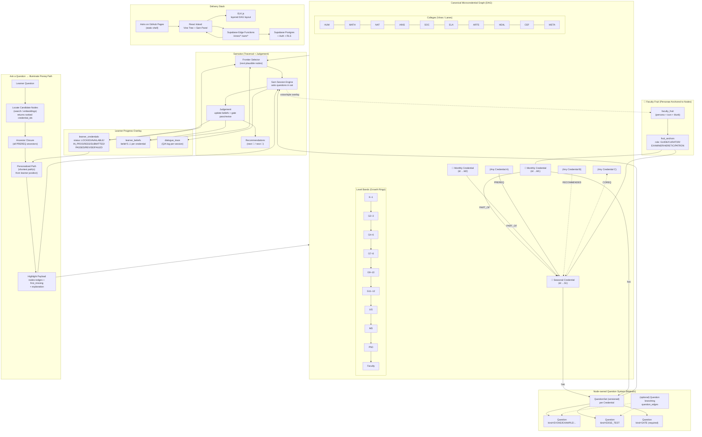

# System Graph: The Tree of Vines

This Mermaid flowchart shows the complete system architecture, including the canonical curriculum DAG, learner personalization, Samwise traversal engine, faculty fruit, and the "ask → illuminate" overlay.

## Notes

- This is the **system graph** showing architecture and data flow
- For the **actual curriculum content graph** (e.g., K–6 or HS→A-level-aligned), specify the scope ("K–6 Math + HUM", "all K–6", etc.) to generate a real node/edge graph (Mermaid + JSON) that can be loaded into the viewer
